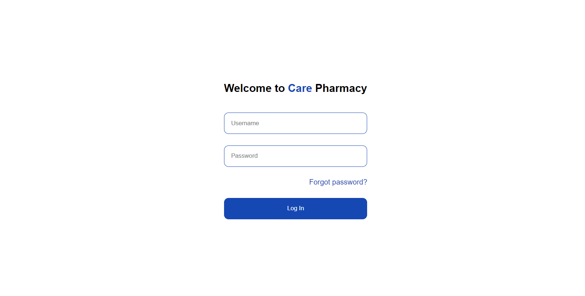
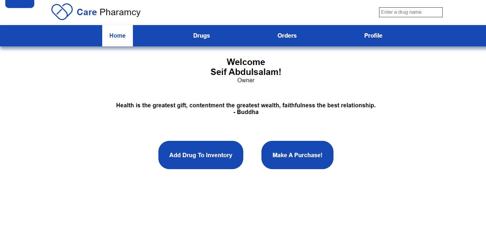
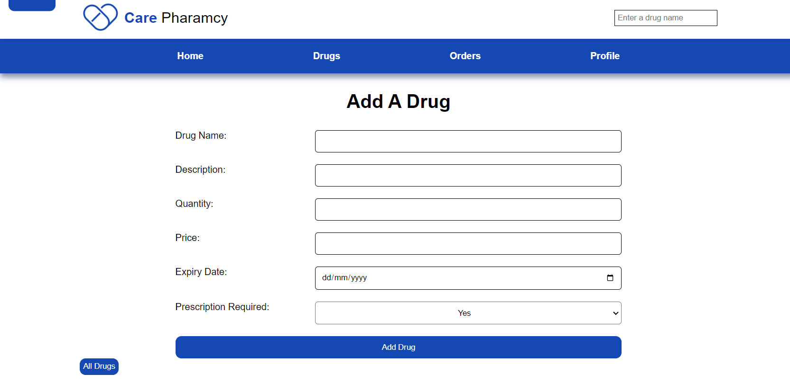
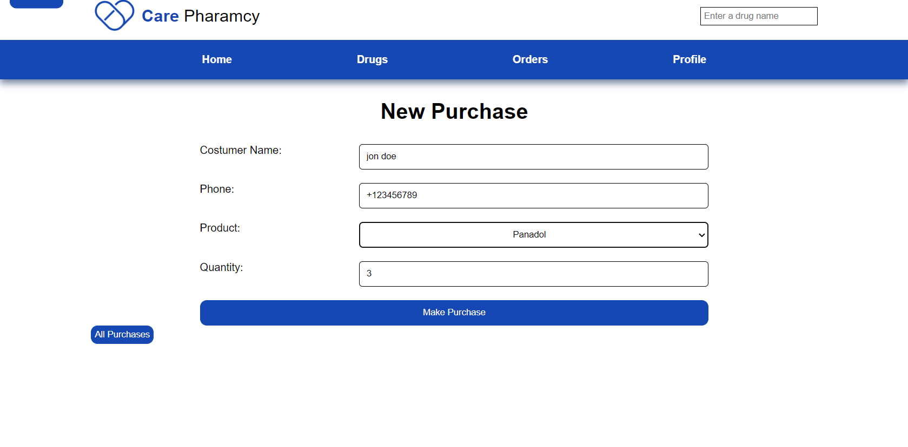

# Pharmacy-Management-system
## Description 
a comprehensive web-based pharmacy management system designed to facilitate the
workflow for pharmacists. The system enables pharmacists to efficiently manage inventory, search for
product, process sales orders, and track all sales transactions.
## Technologies Used:

 

## Features
- Inventory Management
  - Add a new product
  - Remove a product
  - Update product information
  - view detailed product page
  - search for a product
- Order tracking
  - see all transactions 
  - search for transactions by **id**, **customer name**, **customer's phone number**

- Profile Management 
- Staff Management
## UI Screenshots
|Login Page | Home Page|
|---|----|
| |  |
| Add A New Drug Page | Make A Purchase Page|
| |  |
|All drugs page|Profile page | 
   |  | 

## Getting Started
### Dependencies
Make sure you have **`PHP`** 8.1 or higher, **`Laravel`** 10.10 or higher, **`Composer`** installed 

1. Clone the repository 
```shell
git clone https://github.com/Sapagh21/Pharmacy-Management-system.git
 ``` 
2. Navigate to the project's directory
```shell
cd .\Pharmacy-Management-system\
```
3. Install packages with composer
```shell
composer install
```
4. Create your database (optional) <br>
The project's initial database exists in `Database/database.sqlite`, but you can create a new database if you want.

5. copy .env from .env.example at the project root directory
```
cp .env.example ./.env 
```
6. Generate app key 
```bash
php artisan key:generate
```
7. Set database connection to your database in the .env file <br>
Edit the .env file to match your database settings. Below are example settings for using SQLite. Adjust according to your database configuration.
```bash
DB_CONNECTION=sqlite
DB_HOST=127.0.0.1
DB_PORT=3306
DB_DATABASE=database/db.sqlite
DB_USERNAME=root
DB_PASSWORD=
```
8. Start the development Server
```
php artisan serve
```


## If you run through any issues feel free to contanct me ♥
### [LinkedIn](https://www.linkedin.com/in/sapagh21/)